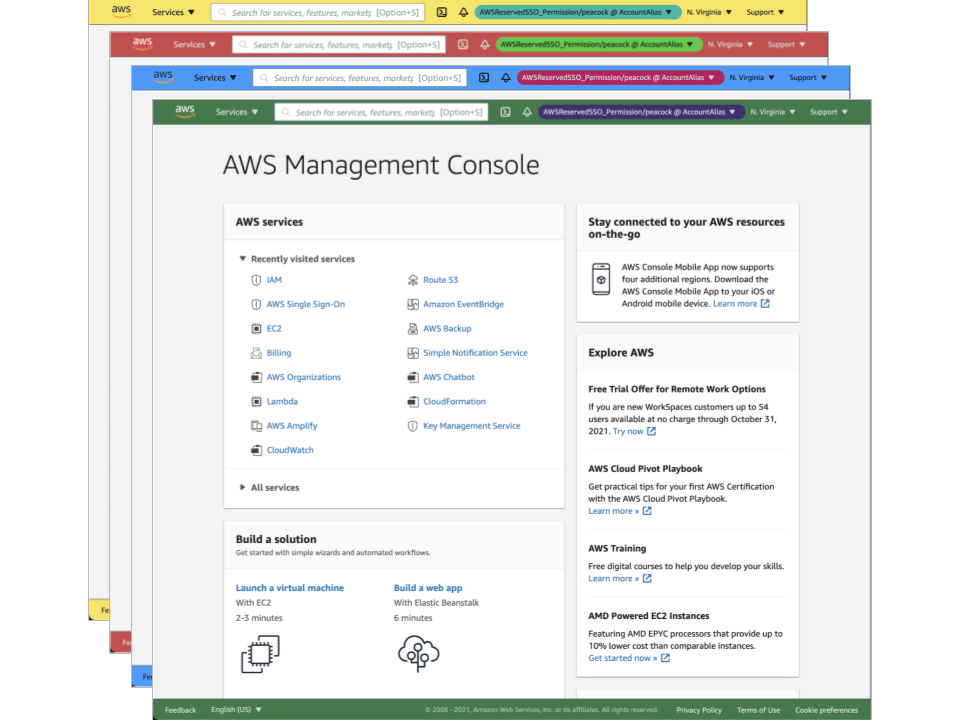

# AWS Peacock Management Console 

[](https://chrome.google.com/webstore/detail/aws-peacock-management-co/bknjjajglapfhbdcfgmhgkgfomkkaidj?utm_source=github)

Browser Extension to show account alias and change color of AWS Management Console, even if AWS SSO.



AWS Peacock Management Console store configuration which maps environment(Account ID and Region) to style(color). In AWS Management Console, it modify HTML tags to change color and show account alias.

## Disclaimer

While effort has been made to ensure the accuracy of the program, developers assumes no responsibility for any problem caused by this extension.

## Install

- [AWS Peacock Management Console \- Chrome Web Store](https://chrome.google.com/webstore/detail/aws-peacock-management-co/bknjjajglapfhbdcfgmhgkgfomkkaidj?utm_source=github)

## Development

```shell
yarn
yarn watch
# Click `Load Unpacked` from chrome://extensions and select .`/dist`
```

## License

Code is provided by [LICENSE](./LICENSE). (icons are not included)  
Icons made by [Freepik](https://www.flaticon.com/authors/freepik) from [www.flaticon.com](https://www.flaticon.com/)

## References and Inspiration

- [Peacock \- Visual Studio Marketplace](https://marketplace.visualstudio.com/items?itemName=johnpapa.vscode-peacock)
- [tilfinltd/aws\-extend\-switch\-roles: Extend your AWS IAM switching roles by Chrome extension, Firefox add\-on, or Edge add\-on](https://github.com/tilfinltd/aws-extend-switch-roles)
- [yaggytter/chrome\-extension\-awssso: Chrome Extension for AWS SSO](https://github.com/yaggytter/chrome-extension-awssso)
