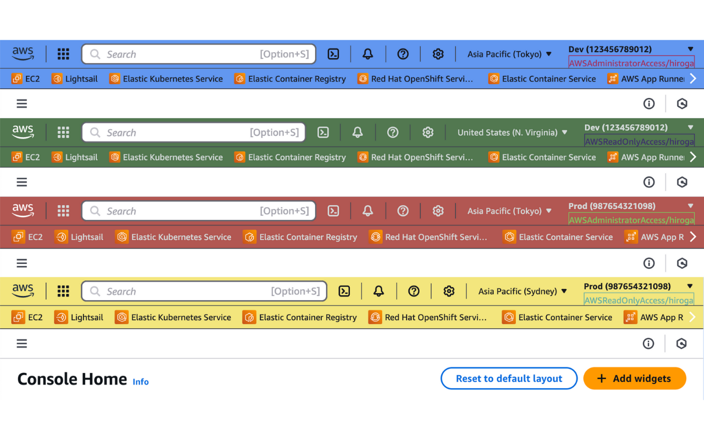
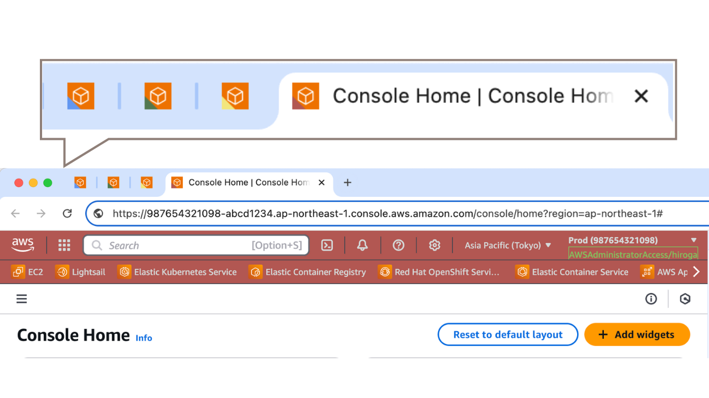

# AWS Peacock Management Console 

[](https://chrome.google.com/webstore/detail/aws-peacock-management-co/bknjjajglapfhbdcfgmhgkgfomkkaidj?utm_source=github)
[](https://addons.mozilla.org/firefox/addon/aws-peacock-management-console/)

You can flexibly set the header and footer colors of the AWS Management Console based on Account ID, Role name, Permission Set, and Region.

## Features

✅ Set header and footer colors based on Account ID, Role name, Permission Set, and Region  
✅ Full support for AWS SSO  
✅ Full support for Multi-session  
✅ Display a colored badge ◣ at the bottom left of the favicon to make it instantly recognizable even when multiple sessions are open  
✅ Display account names to make the current account clear even without setting account aliases  

| Change color                        | Colored favicon                              | Show account names                             |
| ----------------------------------- | -------------------------------------------- | ---------------------------------------------- |
|  |  |  |

## Disclaimer

While effort has been made to ensure the accuracy of the program, developers assumes no responsibility for any problem caused by this extension.

## Install

- [AWS Peacock Management Console - Chrome Web Store](https://chrome.google.com/webstore/detail/aws-peacock-management-co/bknjjajglapfhbdcfgmhgkgfomkkaidj?utm_source=github)
- [AWS Peacock Management Console – 🦊 Firefox ADD-ONS](https://addons.mozilla.org/firefox/addon/aws-peacock-management-console/)

## Development

```shell
yarn
yarn watch
# Click `Load Unpacked` from chrome://extensions and select .`/dist`
```

## License

Code is provided by [LICENSE](./LICENSE). (icons are not included)  
Icons made by [Freepik](https://www.flaticon.com/authors/freepik) from [www.flaticon.com](https://www.flaticon.com/)

## References and Inspiration

- [Peacock - Visual Studio Marketplace](https://marketplace.visualstudio.com/items?itemName=johnpapa.vscode-peacock)
- [tilfinltd/aws-extend-switch-roles: Extend your AWS IAM switching roles by Chrome extension, Firefox add-on, or Edge add-on](https://github.com/tilfinltd/aws-extend-switch-roles)
- [yaggytter/chrome-extension-awssso: Chrome Extension for AWS SSO](https://github.com/yaggytter/chrome-extension-awssso)
